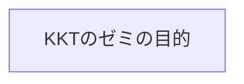
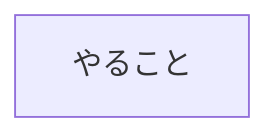
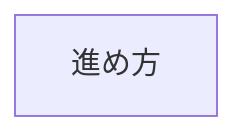
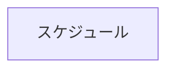
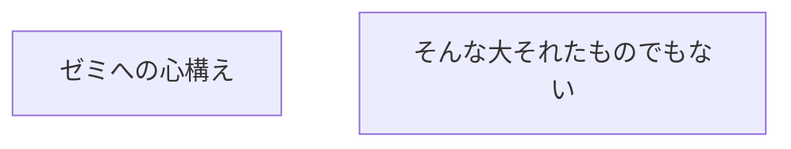
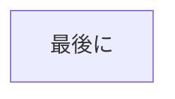

# KKTseminar

```mermaid
graph TD

[2022 Summer KKT seminar]

```

こんにちは。はやしです。

このページは、２０２２年夏から始動するKKTゼミの概要のメモです。



KKTゼミの目的は、『アクチュアリー試験の「会計・経済・投資理論」に合格する力をつける』ことです。会計も経済も投資理論も、本腰を入れて勉強すれば、どれも面白くてKKTしか勉強したくなってしまい他の科目に支障をきたす可能性があるので、あくまでも「KKTの合格」を目指して頑張りましょう！



具体的にゼミでなにやるとー？っていう話ですが、「夏学期はTの全範囲を理解すること」の達成を目指します。最後の２週間で、会計の設例をざっと解説する予定ですが、進度によって変更あるかもです。
理由を以下ざっくりと書いておきます（読み飛ばしても構いません）。

・みんなの会計の知識に差がありそうで、全員が幸せな進行が難しい

・経済は、読めばわかる

・投資理論は配点が大きく（１００点中５０点）得点源にしたいところ。事前知識も期待値と分散くらいが分かっ
ていれば勉強可能なので、フラットな状態で始められる



教科書メインで進めます。若干講義のような形になる可能性ありますが、自分の解説・講義も完ぺきではないので、どんどん意見や疑問を投げてください。

具体的には、投資理論の考え方や諸々の定義など教科書の基礎的な内容を抑えていきます。具体的な問題まで手が回るかわからないので、演習や復習は各自よろしくです。



6/4  (土)　理論篇第1章・第2章　投資家の選好　ポートフォリオ理論

6/11(土)　理論篇第3章　　　　  CAPM

6/18(土)　理論篇第5章・第7章　リスクニュートラル・プライシング

6/25(土)　実務篇第1章　　　　  債券投資分析

7/2  (土)　実務篇第2章　　　　  株式投資分析

7/9  (土)　実務篇第4章　　　　  デリバティブ投資

7/16(土)　財務会計講義第23版　第1章～第9章　　設例解説

7/23(土)　財務会計講義第23版　第10章～第12章　設例開設



Ｔについては、毎週ざっとでいいので該当章を読んでくるといいかもしれません。

Ｋ（会計）については、設例を解き進めておいてください。計算方法が分からなかったり、仕訳で意味の分からん部分があったらメモしておいてください。そこを中心に解説していきます（解説できるとは言っていない）

会計については、どんどん読み進めておいてください。多分最初は何をいわはるのか全く分からないかと思いますが、とにかく読み込むことが会計の制覇への近道です。会計の勉強方法については他のページで書こうかなとも思ってます。



いろいろ書きましたが、とにかくこの自主ゼミの目的は、参加者全員がＫＫＴ科目に合格することです。もっというと、「最小限の労力で合格すること」です。みなさんの力になれたらええなと思ってます。みなさんも力を貸してね！！
